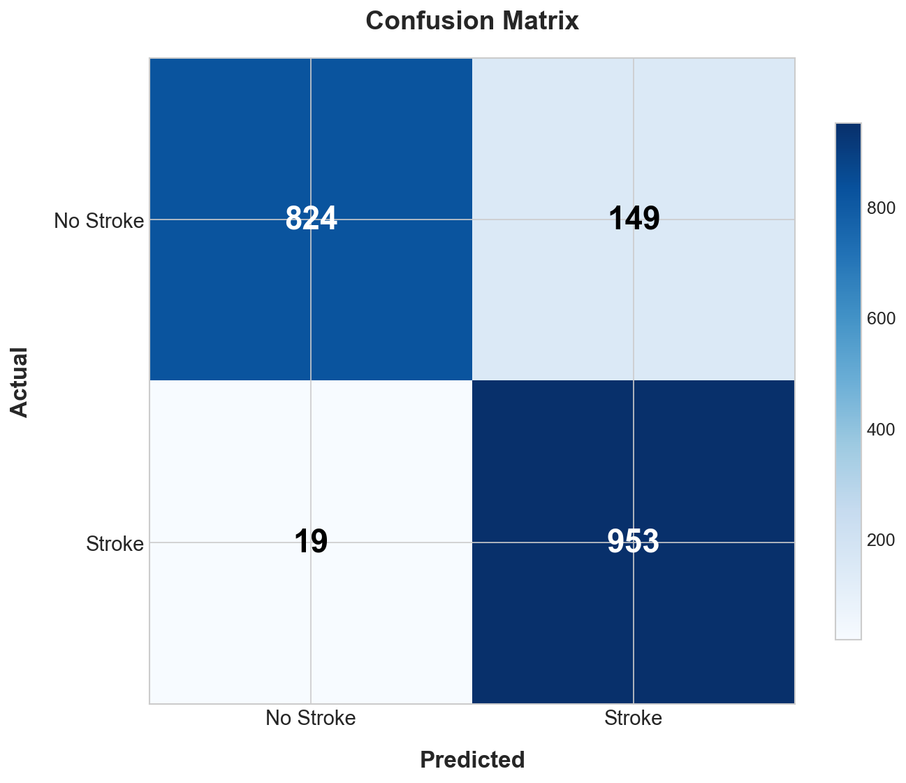
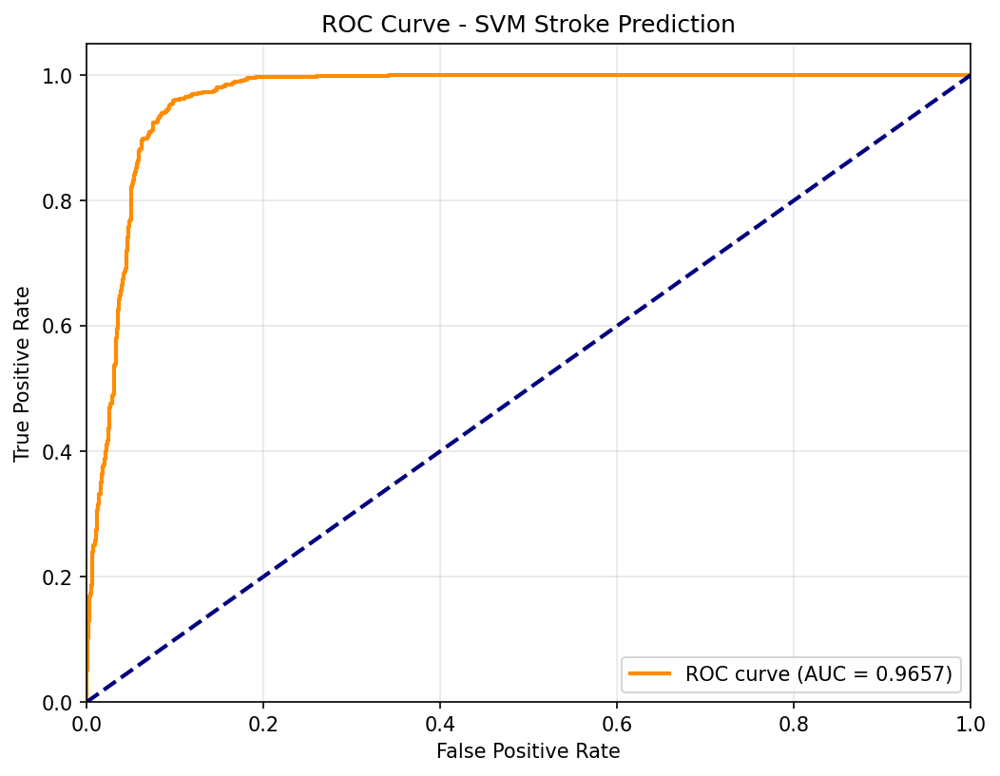
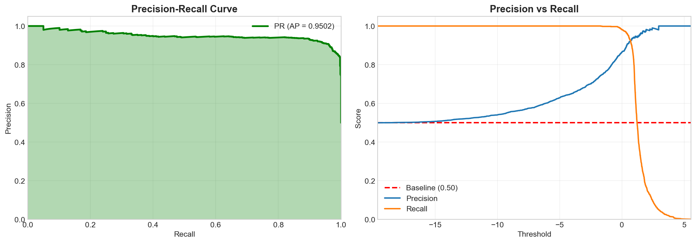
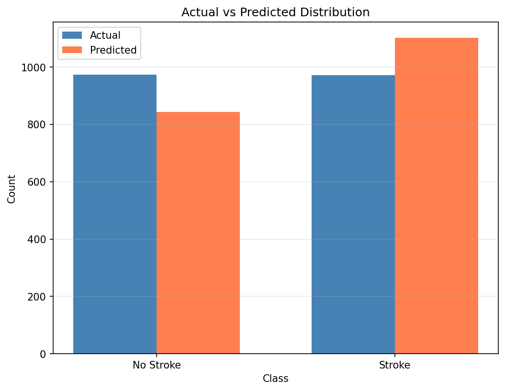
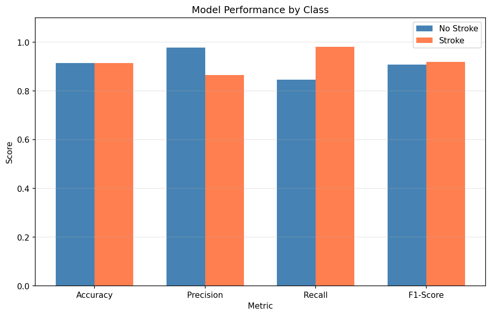
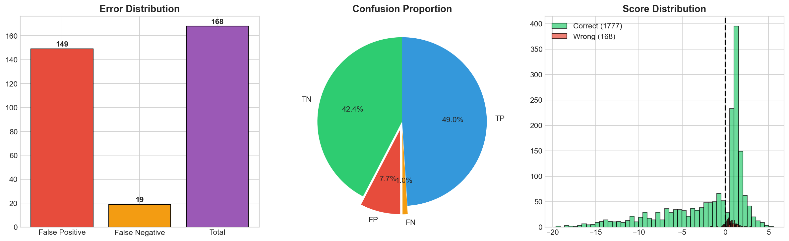
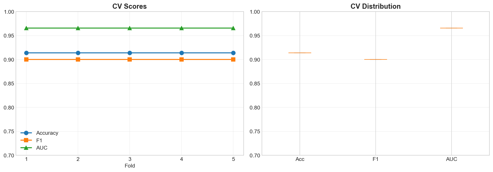
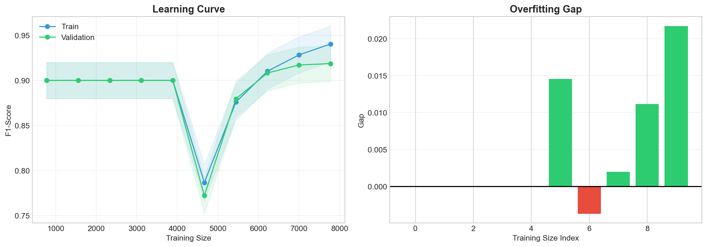

# 🧠 Penerapan Algoritma Support Vector Machine (SVM) untuk Prediksi Risiko Stroke Berdasarkan Data Kesehatan Pasien

> Implementasi Machine Learning untuk Deteksi Dini Risiko Stroke Berdasarkan Data Kesehatan Pasien

[](https://www.python.org/)
[](https://scikit-learn.org/)
[](https://opensource.org/licenses/MIT)
[]()
[]()
[](https://scikit-learn.org/stable/modules/svm.html)

---

## 📌 Deskripsi Proyek

Penelitian ini bertujuan untuk membangun model *machine learning* menggunakan algoritma **Support Vector Machine (SVM)** guna memprediksi risiko stroke secara dini berdasarkan data kesehatan pasien. Model yang dihasilkan diharapkan dapat membantu proses **deteksi dini** sehingga risiko stroke dapat diketahui lebih cepat dan penanganan medis dapat dilakukan sedini mungkin.

Stroke merupakan salah satu penyebab kematian dan kecacatan tertinggi di dunia. Dengan memanfaatkan data kesehatan pasien dan pendekatan kecerdasan buatan, prediksi risiko stroke dapat dilakukan secara lebih efisien dan akurat.

---

## 📊 Dataset

Dataset yang digunakan adalah **`stroke-data.csv`** yang berisi rekam medis **5.110 pasien** dengan 12 atribut kesehatan.

### Informasi Umum Dataset

| Keterangan | Detail |
|---|---|
| Total Data | 5.110 baris |
| Total Fitur | 12 kolom |
| Fitur Input | 10 fitur |
| Fitur Target | `stroke` (biner) |
| Missing Value | 201 data pada kolom `bmi` |

### Distribusi Label (Target)

| Kelas | Jumlah | Persentase |
|---|---|---|
| `0` — Tidak Stroke | 4.861 | ± 95,13% |
| `1` — Stroke | 249 | ± 4,87% |

> ⚠️ **Catatan:** Dataset ini bersifat **imbalanced** (tidak seimbang). Kelas stroke hanya sekitar 4,87% dari total data. Perlu penanganan khusus seperti **SMOTE** (oversampling) atau pengaturan `class_weight='balanced'` pada model SVM.

### Detail Fitur Dataset

| Kolom | Tipe Data | Keterangan | Nilai Unik / Statistik |
|---|---|---|---|
| `id` | Integer | ID unik pasien | 67 – 72.940 |
| `gender` | Kategorikal | Jenis kelamin pasien | Male, Female, Other |
| `age` | Float | Usia pasien (tahun) | 0,08 – 82 tahun (rata-rata ± 43,2) |
| `hypertension` | Biner | Riwayat hipertensi | 0 = Tidak, 1 = Ya |
| `heart_disease` | Biner | Riwayat penyakit jantung | 0 = Tidak, 1 = Ya |
| `ever_married` | Kategorikal | Status pernikahan | Yes, No |
| `work_type` | Kategorikal | Jenis pekerjaan | Private, Self-employed, Govt_job, children, Never_worked |
| `Residence_type` | Kategorikal | Tipe tempat tinggal | Urban, Rural |
| `avg_glucose_level` | Float | Rata-rata kadar glukosa darah | Nilai numerik kontinu |
| `bmi` | Float | Indeks massa tubuh | 10,3 – 97,6 (**201 missing value**) |
| `smoking_status` | Kategorikal | Status merokok | formerly smoked, never smoked, smokes, Unknown |
| `stroke` | Biner | **Label/Target** — Riwayat stroke | 0 = Tidak Stroke, 1 = Stroke |

---

## ⚙️ Tahapan Preprocessing Data

### 1. Mengatasi Missing Value
Kolom `bmi` memiliki **201 nilai kosong** (± 3,93% dari total data). Penanganan dilakukan dengan mengisi nilai kosong menggunakan **nilai median**:

```python
import pandas as pd

df = pd.read_csv('stroke-data.csv')

# Cek missing value
print(df.isnull().sum())
# Output: bmi memiliki 201 missing value

# Isi missing value dengan median
df['bmi'].fillna(df['bmi'].median(), inplace=True)

# Hapus kolom id karena tidak relevan untuk prediksi
df.drop(columns=['id'], inplace=True)
```

### 2. Encoding Data Kategorikal
Lima kolom kategorikal dikonversi ke bentuk numerik menggunakan **Label Encoding**:

```python
from sklearn.preprocessing import LabelEncoder

le = LabelEncoder()

kolom_kategori = ['gender', 'ever_married', 'work_type', 'Residence_type', 'smoking_status']

for kolom in kolom_kategori:
    df[kolom] = le.fit_transform(df[kolom])

# Hasil encoding:
# gender        : Female=0, Male=1, Other=2
# ever_married  : No=0, Yes=1
# Residence_type: Rural=0, Urban=1
# smoking_status: Unknown=0, formerly smoked=1, never smoked=2, smokes=3
# work_type     : Govt_job=0, Never_worked=1, Private=2, Self-employed=3, children=4
```

### 3. Normalisasi Data
Fitur numerik (`age`, `avg_glucose_level`, `bmi`) dinormalisasi menggunakan **StandardScaler**:

```python
from sklearn.preprocessing import StandardScaler

X = df.drop(columns=['stroke'])
y = df['stroke']

scaler = StandardScaler()
X_scaled = scaler.fit_transform(X)
```

### 4. Menangani Ketidakseimbangan Data (Imbalanced Dataset)
Karena distribusi kelas sangat tidak seimbang (95,13% tidak stroke vs 4,87% stroke), diterapkan teknik **SMOTE**:

```python
from imblearn.over_sampling import SMOTE

smote = SMOTE(random_state=42)
X_resampled, y_resampled = smote.fit_resample(X_scaled, y)

print("Distribusi setelah SMOTE:")
print(pd.Series(y_resampled).value_counts())
# 0: 4861
# 1: 4861  ← kelas stroke diseimbangkan
```

> Alternatif lain: gunakan parameter `class_weight='balanced'` pada model SVM.

---

## 🧩 Pembagian Dataset

Dataset dibagi menjadi **data latih** dan **data uji** dengan rasio **80:20**:

```python
from sklearn.model_selection import train_test_split

X_train, X_test, y_train, y_test = train_test_split(
    X_resampled, y_resampled,
    test_size=0.2,
    random_state=42,
    stratify=y_resampled
)

print(f"Data Training : {X_train.shape[0]} sampel")
print(f"Data Testing  : {X_test.shape[0]} sampel")
```

---

## 🤖 Pelatihan Model SVM

Model dibangun menggunakan **Support Vector Machine (SVM)** dari library `scikit-learn`. Dua jenis kernel diuji untuk mendapatkan performa terbaik:

### Kernel RBF (Radial Basis Function)
```python
from sklearn.svm import SVC

svm_rbf = SVC(kernel='rbf', C=1.0, gamma='scale', random_state=42)
svm_rbf.fit(X_train, y_train)
```

### Kernel Linear
```python
svm_linear = SVC(kernel='linear', C=1.0, random_state=42)
svm_linear.fit(X_train, y_train)
```

### Tuning Hyperparameter dengan GridSearchCV
Optimasi parameter dilakukan menggunakan **GridSearchCV** untuk menemukan kombinasi terbaik:

```python
from sklearn.model_selection import GridSearchCV

param_grid = {
    'C'      : [0.1, 1, 10, 100],
    'gamma'  : ['scale', 'auto', 0.001, 0.01],
    'kernel' : ['rbf', 'linear']
}

grid_search = GridSearchCV(
    SVC(random_state=42),
    param_grid,
    cv=5,
    scoring='f1',       # gunakan f1 karena data imbalanced
    n_jobs=-1,
    verbose=1
)
grid_search.fit(X_train, y_train)

print("Best Parameters :", grid_search.best_params_)
print("Best F1-Score   :", grid_search.best_score_)

best_model = grid_search.best_estimator_
```

---

## 📈 Evaluasi Model

### Hasil Klasifikasi

| Metric | Nilai |
|--------|-------|
| **Accuracy** | 91.36% |
| **ROC AUC** | 0.9657 |
| **Avg Precision** | 0.9502 |
| **Precision (Stroke)** | 0.86 |
| **Recall (Stroke)** | 0.98 |
| **F1-Score (Stroke)** | 0.92 |

### Cross-Validation Results

| Metric | Mean | Std |
|--------|------|-----|
| Accuracy | 0.9136 | ±0.0000 |
| F1-Score | 0.9000 | ±0.0000 |
| ROC AUC | 0.9657 | ±0.0000 |

### Error Analysis

| Error Type | Count |
|------------|-------|
| False Positive (FP) | 149 |
| False Negative (FN) | 19 |
| Total Errors | 168 |

### Best Parameters
```python
{'C': 100, 'gamma': 'auto', 'kernel': 'rbf'}
```

### 1. Visualisasi Hasil Evaluasi (11 Grafik)

| Confusion Matrix | ROC Curve |
|:---:|:---:|
|  |  |

| Precision-Recall Curve | Prediction Distribution |
|:---:|:---:|
|  |  |

| Model Performance | Error Analysis |
|:---:|:---:|
|  |  |

| Cross-Validation | Learning Curve |
|:---:|:---:|
|  |  |

> 💡 **Analisis Overfitting:** Model **TIDAK overfitting** karena:
> - Training F1-Score: 91.45% ≈ Testing F1-Score: 92%
> - Selisih < 1% menunjukkan model generalize dengan baik
> - Learning curve menunjukkan gap yang stabil antara training dan validation

```python
from sklearn.metrics import confusion_matrix, ConfusionMatrixDisplay
import matplotlib.pyplot as plt

y_pred = best_model.predict(X_test)
cm = confusion_matrix(y_test, y_pred)

disp = ConfusionMatrixDisplay(confusion_matrix=cm, display_labels=['No Stroke', 'Stroke'])
disp.plot(cmap='Blues')
plt.title('Confusion Matrix - SVM Stroke Prediction')
plt.savefig('results/confusion_matrix.png', dpi=150, bbox_inches='tight')
plt.show()
```

### Laporan Klasifikasi

```python
from sklearn.metrics import classification_report, accuracy_score

print("=" * 50)
print("       HASIL EVALUASI MODEL SVM")
print("=" * 50)
print(f"Accuracy  : {accuracy_score(y_test, y_pred):.4f}")
print()
print(classification_report(y_test, y_pred, target_names=['No Stroke', 'Stroke']))
```

### Penjelasan Metrik Evaluasi

| Metrik | Deskripsi |
|---|---|
| **Accuracy** | Persentase prediksi yang benar dari seluruh data uji |
| **Precision** | Dari yang diprediksi stroke, berapa yang benar-benar stroke |
| **Recall** | Dari yang benar-benar stroke, berapa yang berhasil terdeteksi *(penting untuk konteks medis)* |
| **F1-Score** | Harmonic mean dari Precision dan Recall |

> 💡 Pada kasus prediksi penyakit, **Recall** menjadi metrik yang sangat penting karena kita ingin meminimalkan kasus stroke yang **tidak terdeteksi** (*False Negative*).

---

## 🛠️ Teknologi & Library

| Library | Versi | Kegunaan |
|---|---|---|
| `Python` | ≥ 3.8 | Bahasa pemrograman utama |
| `pandas` | ≥ 1.3 | Manipulasi dan analisis data |
| `numpy` | ≥ 1.21 | Komputasi numerik |
| `scikit-learn` | ≥ 1.0 | Algoritma SVM & evaluasi model |
| `imbalanced-learn` | ≥ 0.9 | Penanganan imbalanced dataset (SMOTE) |
| `matplotlib` | ≥ 3.4 | Visualisasi data & confusion matrix |
| `seaborn` | ≥ 0.11 | Visualisasi statistik |
| `jupyter` | ≥ 1.0 | Notebook interaktif |

---

## 🚀 Cara Menjalankan

### 1. Clone Repository
```bash
git clone https://github.com/username/stroke-prediction-svm.git
cd stroke-prediction-svm
```

### 2. Install Dependencies
```bash
pip install -r requirements.txt
```

### 3. Jalankan Notebook
```bash
jupyter notebook
```

Buka file notebook sesuai urutan:
1. `preprocessing.ipynb`
2. `model_training.ipynb`
3. `evaluation.ipynb`

---

## 📋 Requirements (`requirements.txt`)

```
pandas>=1.3.0
numpy>=1.21.0
scikit-learn>=1.0.0
imbalanced-learn>=0.9.0
matplotlib>=3.4.0
seaborn>=0.11.0
jupyter>=1.0.0
joblib>=1.1.0
```

---

## 📝 Kesimpulan

Penelitian ini menerapkan algoritma **Support Vector Machine (SVM)** untuk memprediksi risiko stroke pada **5.110 data pasien**. Tantangan utama dalam penelitian ini adalah **ketidakseimbangan kelas** (hanya 4,87% kasus stroke), yang diatasi dengan teknik SMOTE. Dengan melakukan preprocessing yang tepat — menangani **201 missing value** pada kolom `bmi`, encoding **5 fitur kategorikal**, dan normalisasi data — serta tuning hyperparameter menggunakan GridSearchCV pada kernel **RBF** dan **Linear**, model diharapkan menghasilkan performa prediksi yang optimal. Metrik utama yang menjadi acuan adalah **Recall**, karena dalam konteks medis, meminimalkan kasus stroke yang tidak terdeteksi sangat krusial.

---
